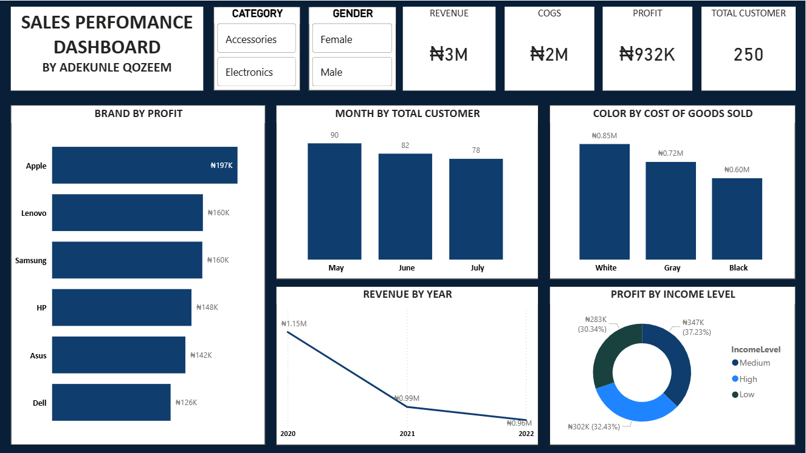

# Qozeem Adekunle | Data Analytics Portfolio

Power BI • Microsoft Excel • Business Intelligence • Data Visualization

# 📈 Sales Performance Dashboard (Power BI)

A dynamic Power BI dashboard designed to analyze sales performance, monitor key business metrics, and provide interactive insights into revenue, profitability, customer behavior, and product performance.

---

# 📌 Business Problem

Business leaders require timely and accurate insights into sales performance to improve profitability and identify opportunities for growth. Traditional reports often lack the flexibility needed to explore data from multiple perspectives.

This dashboard addresses that challenge by providing an interactive Business Intelligence solution for monitoring sales performance and supporting strategic decision-making.

---

# 📖 Project Overview

This Power BI dashboard consolidates sales data into an interactive reporting environment using DAX, Power Query, and data modeling techniques. It enables users to explore performance across products, customers, and sales trends while tracking important KPIs.

---

# 🎯 Business Objectives

- Monitor total sales and profitability.
- Evaluate product performance.
- Identify high-performing products.
- Analyze customer purchasing behavior.
- Track monthly sales trends.
- Support executive decision-making through interactive reporting.

---

# 📊 Dashboard Preview

---

# 📈 Key KPIs

- Total Sales
- Total Profit
- Profit Margin
- Total Orders
- Average Sales
- Top Selling Products

---

# 🛠 Tools Used

- Power BI
- DAX
- Power Query
- Microsoft Excel

---

# 💡 Key Insights

- A small number of products generate a significant share of total sales revenue.
- Customer purchasing behavior differs across product categories, creating opportunities for targeted marketing.
- Monthly sales trends reveal periods of peak demand that can support inventory planning.
- Profit margins vary across products, highlighting opportunities to improve pricing and product mix.
- Interactive visualizations provide management with a real-time view of overall business performance.

---

# 🚀 Business Recommendations

- Focus marketing campaigns on high-performing products while improving visibility for lower-performing items.
- Optimize pricing strategies for products with lower profit margins.
- Use customer purchasing trends to design targeted promotions.
- Increase inventory before periods of high seasonal demand.
- Continue monitoring KPIs through interactive Power BI dashboards to support ongoing business decisions.

---

# 📈 Business Impact

The dashboard helps management to:

- Monitor business performance in real time.
- Improve strategic planning.
- Identify growth opportunities.
- Track profitability more effectively.
- Make faster, data-driven decisions.

---

# 🚀 Skills Demonstrated

- Power BI
- DAX
- Power Query
- Data Modeling
- Data Cleaning
- Dashboard Design
- Data Visualization
- KPI Development
- Business Intelligence
- Data Storytelling

---

# 👤 Author

**Qozeem Adekunle**

Data Analyst | Power BI | Microsoft Excel | Business Intelligence

- LinkedIn: *(https://www.linkedin.com/in/qozeem-adekunle-62560a3a9/
)*
- GitHub: *(https://github.com/Qozeem-Adekunle
)*
